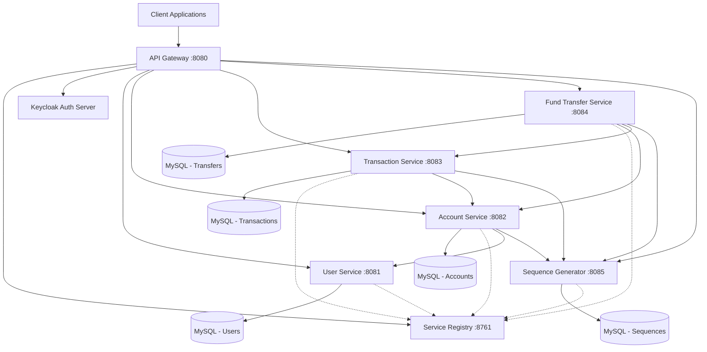

# 🏗️ Banking Application - System Architecture

## 📊 Architecture Overview

## 🔧 Component Details

### Infrastructure Services

#### Service Registry (Eureka Server)
- **Port**: 8761
- **Purpose**: Service discovery and registration
- **Technology**: Netflix Eureka Server
- **Dependencies**: Spring Boot, Actuator

#### API Gateway
- **Port**: 8080
- **Purpose**: Single entry point, routing, security
- **Technology**: Spring Cloud Gateway
- **Security**: OAuth2, JWT validation
- **Dependencies**: Eureka Client, OAuth2 Resource Server

### Business Services

#### User Service
- **Port**: 8081
- **Database**: MySQL (users schema)
- **Responsibilities**:
  - User registration and management
  - Keycloak integration
  - Profile operations
  - Authentication support

#### Account Service
- **Port**: 8082
- **Database**: MySQL (accounts schema)
- **Responsibilities**:
  - Account creation and management
  - Balance operations
  - Account validation
- **Dependencies**: User Service, Sequence Generator

#### Transaction Service
- **Port**: 8083
- **Database**: MySQL (transactions schema)
- **Responsibilities**:
  - Transaction recording
  - Deposit/Withdrawal operations
  - Transaction history
- **Dependencies**: Account Service, Sequence Generator

#### Fund Transfer Service
- **Port**: 8084
- **Database**: MySQL (transfers schema)
- **Responsibilities**:
  - Inter-account transfers
  - Transfer validation and processing
  - Transfer history
- **Dependencies**: Account Service, Transaction Service, Sequence Generator

#### Sequence Generator Service
- **Port**: 8085
- **Database**: MySQL (sequences schema)
- **Responsibilities**:
  - Unique ID generation
  - Account number generation
  - Transaction reference generation

## 🔄 Communication Patterns

### Service-to-Service Communication
- **Protocol**: HTTP/REST
- **Client**: OpenFeign
- **Discovery**: Eureka-based service discovery
- **Load Balancing**: Client-side (Ribbon)

### Database Pattern
- **Pattern**: Database per Service
- **Technology**: MySQL for all services
- **Isolation**: Each service owns its data schema

### Security Pattern
- **Authentication**: Keycloak OAuth2/OIDC
- **Authorization**: JWT tokens
- **Gateway Security**: Centralized at API Gateway
- **Service Security**: Token validation

## 📈 Scalability Considerations

### Horizontal Scaling
- Each service can be scaled independently
- Load balancing via Eureka/Ribbon
- Stateless service design

### Performance Optimization
- Connection pooling for databases
- Caching strategies (potential Redis integration)
- Async processing for non-critical operations

### Monitoring & Observability
- Spring Boot Actuator endpoints
- Health checks and metrics
- Distributed tracing (potential Zipkin integration)