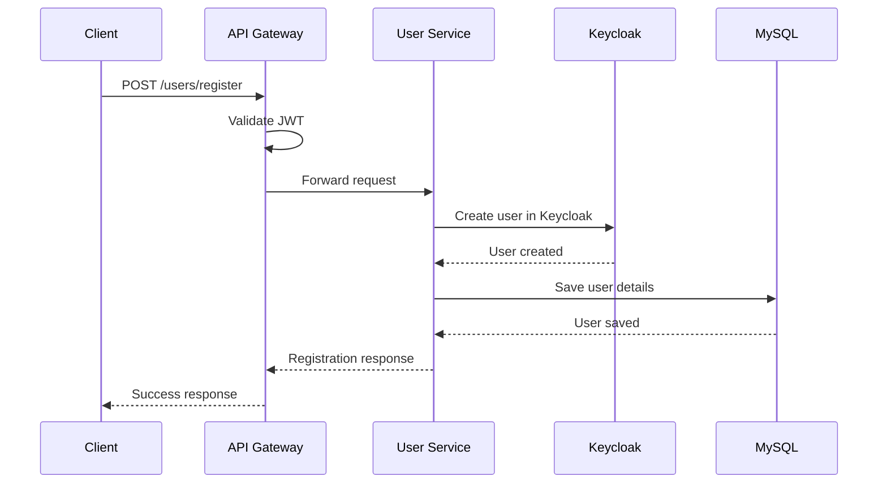
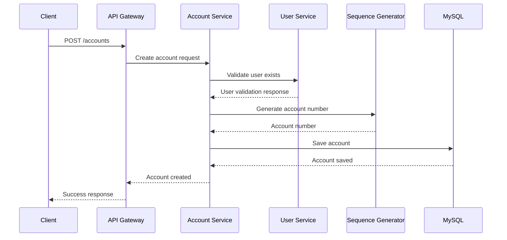
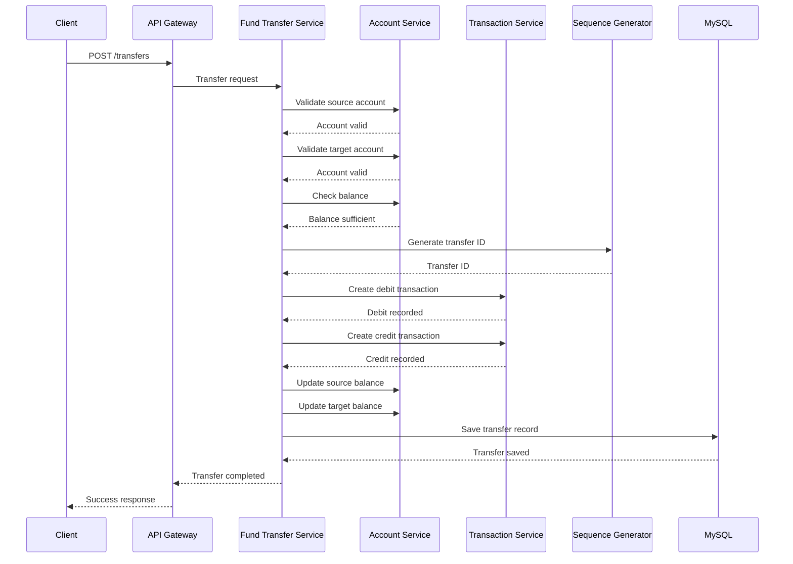
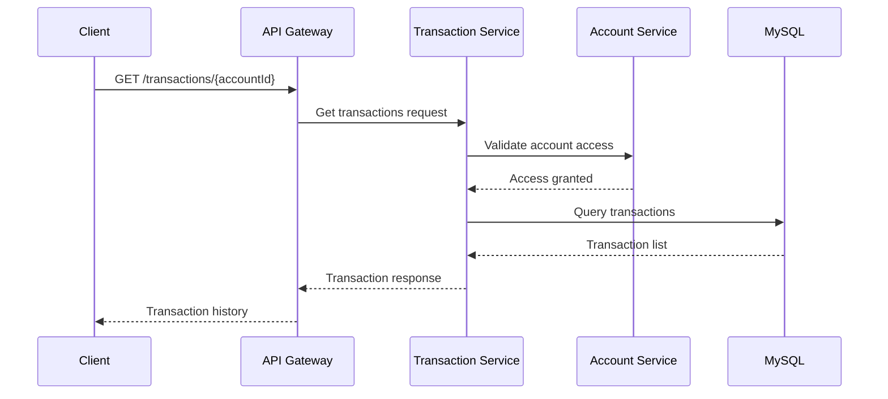
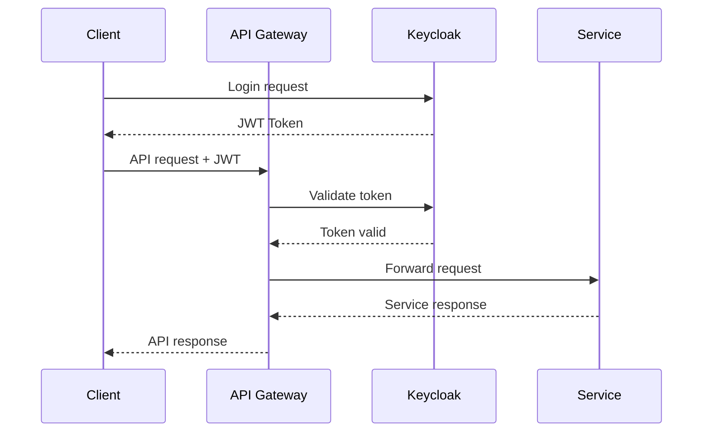
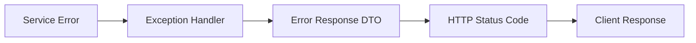
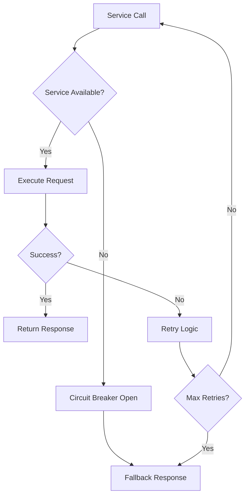

# 🔄 Service Flow Documentation

## 📋 Business Process Flows

### 1. User Registration Flow



### 2. Account Creation Flow



### 3. Fund Transfer Flow



### 4. Transaction History Flow



## 🔐 Security Flow

### Authentication & Authorization Flow



## 📊 Data Flow Patterns

### Service Dependencies

```
User Service (Independent)
    ↓
Account Service → User Service, Sequence Generator
    ↓
Transaction Service → Account Service, Sequence Generator
    ↓
Fund Transfer Service → Account Service, Transaction Service, Sequence Generator
```

### Database Interaction Pattern

```
Service Layer
    ↓
Repository Layer (Spring Data JPA)
    ↓
MySQL Database (Service-specific schema)
```

## 🚨 Error Handling Flow

### Service Error Propagation



### Common Error Scenarios

1. **User Not Found**: 404 - User does not exist
2. **Insufficient Balance**: 400 - Cannot process transaction
3. **Account Inactive**: 403 - Account is closed/suspended
4. **Service Unavailable**: 503 - Downstream service failure
5. **Validation Error**: 400 - Invalid request data

## 🔄 Retry & Circuit Breaker Patterns

### Service Resilience



## 📈 Performance Optimization Flows

### Caching Strategy

```
Request → Cache Check → Cache Hit? → Return Cached Data
                    ↓
                Cache Miss → Database Query → Cache Update → Return Data
```

### Connection Pooling

```
Service Request → Connection Pool → Available Connection? → Execute Query
                                ↓
                            Wait/Create New → Execute Query
```